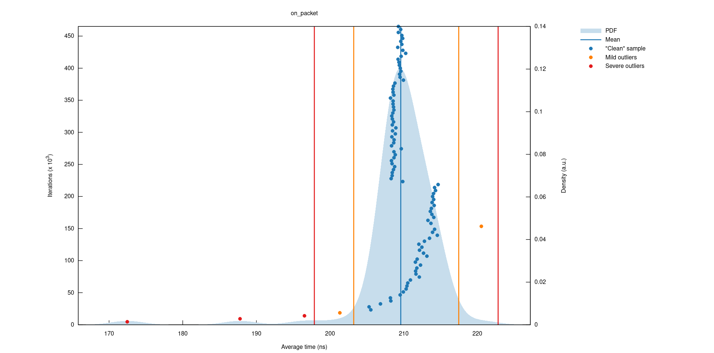
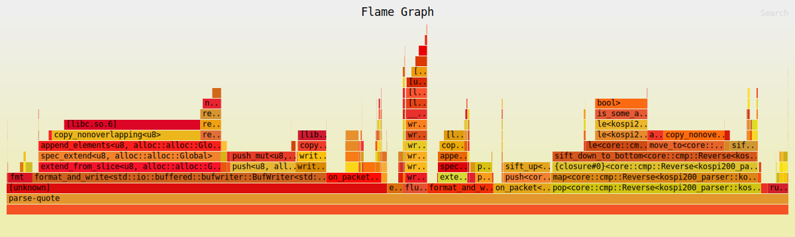

# KOSPI 200 Parser

<!-- ![tests][actions-test-badge] -->

[![MIT/Apache 2.0 licensed][license-badge]]()
[![Crate][crates-badge]][crates-url]
[![docs.rs][docsrs-badge]][docs-url]
![Crates.io MSRV][crates-msrv-badge]

<!--[![codecov-kospi200-parser][codecov-badge]][codecov-url]-->
<!--![Crates.io downloads][crates-download-badge] -->

<!--[actions-test-badge]: https://github.com/carlobortolan/kospi200-parser/actions/workflows/ci.yml/badge.svg -->

[license-badge]: https://img.shields.io/badge/license-MIT%2FApache--2.0-blue.svg
[crates-badge]: https://img.shields.io/crates/v/kospi200-parser.svg
[crates-url]: https://crates.io/crates/kospi200-parser
[docsrs-badge]: https://img.shields.io/docsrs/kospi200-parser
[docs-url]: https://docs.rs/kospi200-parser

<!--[codecov-badge]: https://codecov.io/gh/carlobortolan/kospi200-parser/graph/badge.svg?token=NJ4HW3OQFY
[codecov-url]: https://codecov.io/gh/carlobortolan/kospi200-parser -->

[crates-msrv-badge]: https://img.shields.io/crates/msrv/kospi200-parser

<!--[crates-download-badge]: https://img.shields.io/crates/d/kospi200-parser -->

[license-badge]: https://img.shields.io/badge/license-MIT%2FApache--2.0-blue.svg

Parses and prints quote messages from a historical KOSPI 200 market data feed. When invoked with an `-r` flag, the program re-orders the messages according to the quote accept time at the exchange.

It is designed to consume data either directly from UDP broadcast streams on ports 15515/15516 or by replaying an existing PCAP file. Quote packets begin with the ASCII bytes `B6034` and contain the five current best bids and ask liquidity on the market.

The parser currently uses zero-copy memory mapping (`memmap2`) to read network traffic. Incoming data is stored in a pre-allocated chunk of memory (arena) that sorts out-of-sequence packets by using a 3-second Min-Heap containing the indices of the arena and their packet times.

The heap is sorted by exchange time (quote accept time), but the sliding window evicts based on network time.

## Performance

#### Macro-Benchmark (end-to-end execution; 10.5 GB PCAP file | 38M Packets | 28.8M Quotes)

- User time (seconds): 8.16 seconds
- System time (seconds): 0.46 seconds
- Elapsed (wall clock) time: 8.68 seconds
- Throughput: **~1.2 GB/s**, **4.4M PPS / ~227 ns per packet** (single-threaded)
- Max application heap: **~256 MB initial pre-allocation** (see [calculation](benches/README.md#the-math-behind-the-256-mb))

#### Micro-Benchmark (isolated execution measured with criterion)

A packet is processed in **~209 ns per packet**; roughly 4.8 million PPS sequentially on a single thread.



See [kospi200.pages.dev](https://kospi200.pages.dev/on_packet/report) for full report.

#### CPU Profiling

The flamegraph confirms that once the fixed-size arena and heap are initialized, the parser spends most of its CPU cycles entirely on structural heap sifting (`sift_down_to_bottom`) and raw byte formatting (`copy_nonoverlapping`) and not on memory allocation at runtime.



_Measured on a selfhosted VM with 32 GB RAM, AMD Ryzen 7 PRO 6850U @ 2.70GHz and Manjaro Linux x86_64_

## Output format:

Prints the packet and quote accept times, the issue code, followed by the bids from 5th to 1st, then the asks from 1st to 5th; e.g.:

```xml
<pkt-time> <accept-time> <issue-code> <bqty5>@<bprice5> ... <bqty1>@<bprice1> <aqty1>@<aprice1> ... <aqty5>@<aprice5>
```

## Example usage:

```sh
# Compile for maximum performance
cargo build --release

# Parse a PCAP file with reordering
target/release/parse-quote -r --pcap data/mdf-kospi200.20110216-0.pcap
...
1297814429.998584 09002997 KR4301F32505 0000134@00092 0000199@00093 0000231@00094 0000094@00095 0000308@00096 0000234@00097 0000130@00098 0000282@00099 0000415@00100 0000052@00101
...

# Alternatively, listen to live UDP market data feed
target/release/parse-quote -r --udp 239.0.0.1:15515
```

The handler assumes that the difference between the quote accept time and the PCAP packet time is never more than 3 seconds.

## Minimum supported Rust version (MSRV)

This crate requires a Rust version of 1.86.0 or higher. Increases in MSRV will be considered a semver non-breaking API change and require a version increase (PATCH until 1.0.0, MINOR after 1.0.0).

## License

This project is licensed under either of:

- [MIT license](LICENSE-MIT.md) or
- [Apache License, Version 2.0](LICENSE-APACHE.md)

at your option.

This project is inspired by [this video: Saturating the NIC: A Network Optimization Adventure](https://www.youtube.com/watch?v=Y2Cn7o8QZvA) and [this page](https://www.tsurucapital.com/en/code-sample.html/).

---

© Carlo Bortolan

> Carlo Bortolan &nbsp;&middot;&nbsp;
> GitHub [carlobortolan](https://github.com/carlobortolan) &nbsp;&middot;&nbsp;
> contact via [carlobortolan@gmail.com](mailto:carlobortolan@gmail.com)
